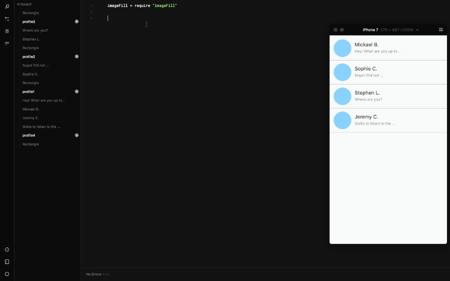

# framer-imageFill
A Framer module to fill layers with random images from **Unsplash**. Search term can be added to get images form a specific theme.



## Installation
1. Download the `imageFill.coffee` file
2. Create a Framer project and add the file in `/modules`
3. At the top of the Framer document write `imageFill = require "imageFill"`

## Usage
1. Install the module as explained in the **Installation** section
2. Create a layer with the properties you want and make sure to also add a **name** (if you made your design directly in Framer Studio V90+, the name is set when you add a target ).
3. Write the following line, if you leave the search term empty, the image will be randomly picked.

    `layer.imageFill("Search term")`
4. Then you can choose if you want to keep this image (✔︎) or if you want the module to get a new one (✘)

## Example
```coffeescript
# Require the module
imageFill = require "imageFill"

# Create a layer
profile = new Layer
    backgroundColor: "#ffffff"
    name: "profile1"
    width: 50
    height: 50
    x: Align.center
    y: Align.center

# Fill the layer with an image of a person
profile.imageFill("person")
```

## Licenses
framer-imageFill is released under the MIT license.

Images from Unsplash are released under the CC0 license [More info here](https://unsplash.com/license). Giving credit is not mandatory, but always appreciated by the photographers 😉

## Contact
Twitter: [@benjarier](https://twitter.com/benjarier)
